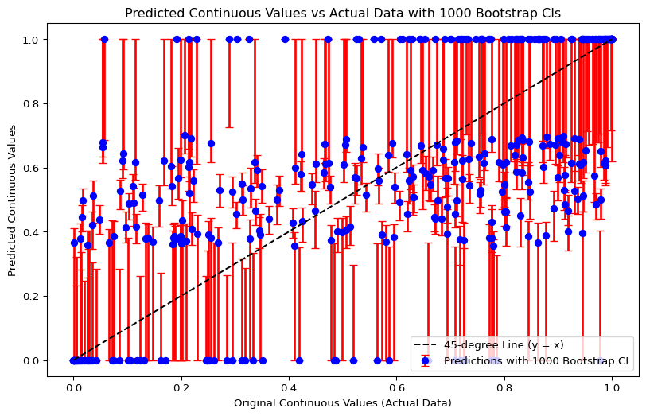
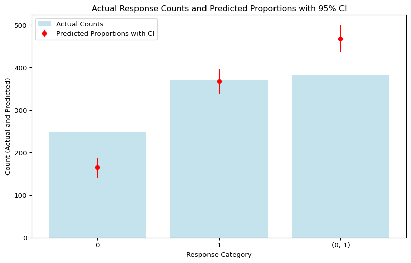

# README
Robert Kubinec

## Introduction

This Github repository hosts the code base for the Python implementation
of the ordered beta regression model using the `scipy` package as the
optimization engine. For more information about this model, please see
the paper at <https://osf.io/preprints/socarxiv/2sx6y>. If you use the
model in published work, please cite the paper as:

Kubinec, Robert. 2023. “Ordered Beta Regression: A Parsimonious,
Well-Fitting Model for Continuous Data with Lower and Upper Bounds.”
*Political Analysis* 31(4): 519–36. doi: 10.1017/pan.2022.20.

## Installation

All of the required model files are in this repository, so simply clone
the repository to your machine and then execute the command below from
the command line. At present, `ordbetareg_py` is not available via
package repositories like `pip`, although that should happen before
long.

``` bash
pip install .
```

## Usage

Please see below for Python code that loads the package, generates data
from the ordered beta distribution, fits the model, performs some model
checks and then plots the model predictions vs. the observed data.

``` python
import numpy as np
from ordbetareg import rordbeta, dordbeta, OrderedBetaModel
import statsmodels.api as sm
```

``` python
# Step 1: Generate exogenous covariates X1 and X2
n_samples = 1000
X1 = np.random.randn(n_samples)  # First covariate
X2 = np.random.randn(n_samples)  # Second covariate

# Step 2: Define a relationship between X1, X2, and mu (mean parameter for ordered beta)
# We'll use a logistic transformation to ensure mu stays between 0 and 1
beta_0 = 0.5  # Intercept
beta_1 = 1.0  # Coefficient for X1
beta_2 = 0.75  # Coefficient for X2

def calculate_mu_with_intercept(X1, X2, beta_0, beta_1, beta_2):
    # Linear model: beta_0 + beta_1 * X1 + beta_2 * X2
    linear_predictor = beta_0 + beta_1 * X1 + beta_2 * X2
    return 1 / (1 + np.exp(-linear_predictor))  # Logistic function to keep mu in (0, 1)

# Calculate mu for each observation based on X1, X2, and the intercept
mu_values = calculate_mu_with_intercept(X1, X2, beta_0, beta_1, beta_2)

# Generate response data using the ordered beta distribution
phi = 2  # Dispersion parameter
cutpoints = (-1, 1)  # Cutpoints for the ordered beta distribution
y = np.array([rordbeta(n=1, mu=mu, phi=phi, cutpoints=cutpoints)[0] for mu in mu_values])

# Stack X1 and X2 into a matrix for the model
X = np.column_stack((X1, X2))
```

``` python
# Fit the ordered beta model using the generated data and the two covariates
ordbeta_model = OrderedBetaModel(y, X).fit()

# Print the summary with regression coefficients, standard errors, confidence intervals, and other statistics
ordbeta_model.summary()
```

    =================================================
                   Ordered Beta Regression            
    =================================================
    Number of observations: 1000
    Degrees of freedom: 994
    Log-likelihood: -685.4926
    AIC: 1382.9852
    BIC: 1412.4317
    -------------------------------------------------
    Parameter      Estimate       Std. Error     CI (95%)                      
    -------------------------------------------------
    Intercept      0.5143         0.2186         (0.0859, 0.9427)
    X1             1.0219         0.1563         (0.7155, 1.3282)
    X2             0.7026         0.1979         (0.3147, 1.0905)
    phi            2.2071         0.5885         (1.0535, 3.3606)
    cutpoint1      -0.9641        0.2128         (-1.3811, -0.5471)
    cutpoint2      1.1398         0.2919         (0.5676, 1.7120)
    =================================================

``` python
# Use the predict method to generate predictions using the fitted model
predictions = ordbeta_model.predict(X)

# Print the first few predictions
print("First 10 predictions:", predictions[:10])

# Compare with actual response values
print("First 10 actual values:", y[:10])

# Calculate RMSE
ordbeta_rmse = ordbeta_model.rmse()
print(f"Ordered Beta Regression RMSE: {ordbeta_rmse:.4f}")
```

    First 10 predictions: [0.35467494 0.         0.38592857 0.         1.         1.
     0.         0.48641763 1.         0.63331494]
    First 10 actual values: [1.         0.41975945 0.18671119 0.78612055 0.94580383 0.92693642
     0.         0.10310931 1.         0.        ]
    Ordered Beta Regression RMSE: 0.3609

``` python
# plot predictions vs. the continuous (0,1) responses in the data
ordbeta_model.plot_continuous_predictions(X)
# plot predictions vs. the discrete (0, 1, or (0,1)) categories in the data
ordbeta_model.plot_categorical_predictions(X)
```




